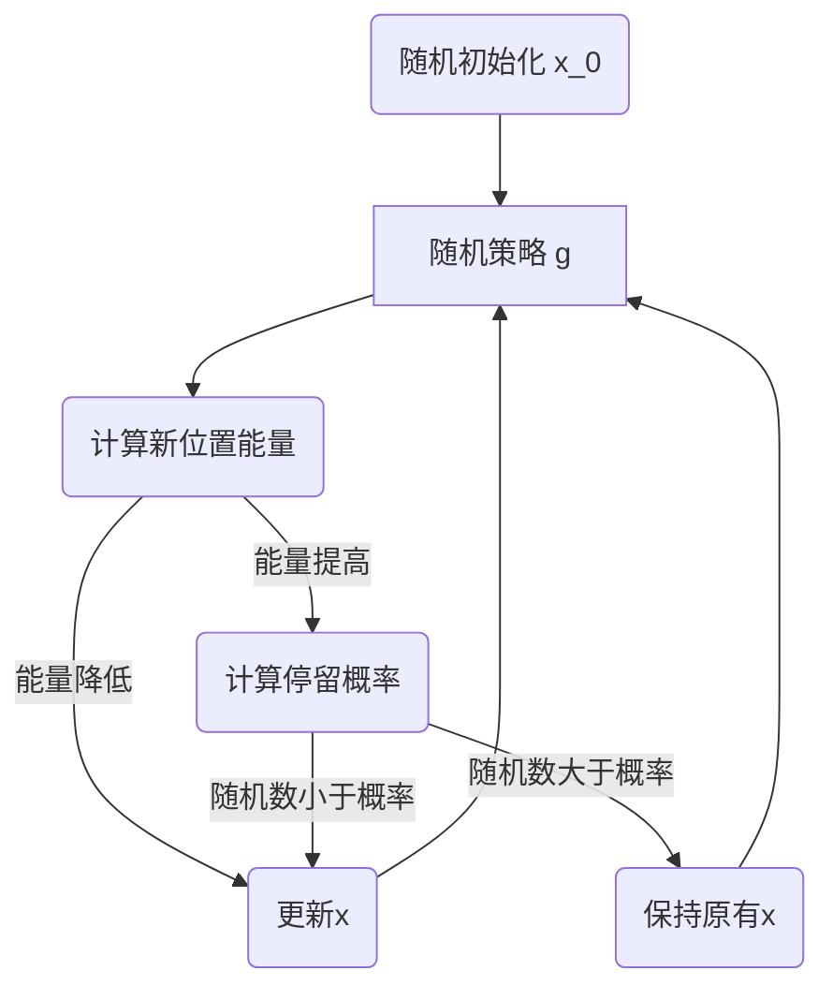

## 模拟退火算法

#### 问题描述

考虑如下约束优化问题
$$
\min_{x\in K}f(x)
$$
这里的 $f$ 也被称为能量。

**超参数**

1. 初始温度 $T_{0}$
2. 结束温度 $\textit{Tend}$
3. 单次温度衰减中，最大循环次数 $L$
4. 温度衰减系数 $a$

**成员方法**

1. 随机策略 $g$，每次 $x$ 的更新方式
2. 停留概率 $p$，$x$ 更新后，留在新坐标的概率

**算法流程**

